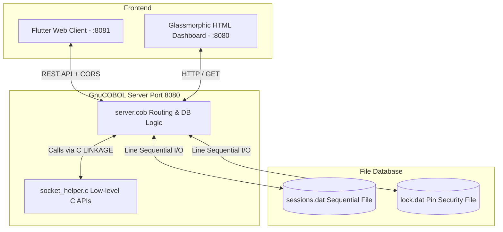

# PranaCOBOL: Guided Breathwork Application

PranaCOBOL is a guided breathwork application featuring a high-performance backend written in GnuCOBOL and C, and a state-of-the-art Flutter Web dashboard. It supports dynamic breathing methods, session logs database storage, and a lock/unlock security system.

---

## System Architecture



The application is split into two primary components:
1. **GnuCOBOL REST Backend & Web Server**: Implements the core business logic, database operations, security authentication, and routes HTTP traffic. It calls low-level C functions to handle TCP socket communication and parse HTTP/JSON strings.
2. **Flutter Web Frontend**: Offers a glassmorphic user interface with ambient background glows, animated breathing rings, notes entry modals, security panels, and real-time history logs.

---

## Component Details

### 1. Backend Architecture (`server.cob` & `socket_helper.c`)
*   **Networking (`socket_helper.c`)**: Manages the socket lifecycle (`server_init`, `server_accept`, `client_read`, `client_write`, `client_close`).
*   **JSON Parsing**: Since native JSON processing is limited in COBOL, the C helper provides `get_json_value` to extract parameters like `method`, `duration`, `notes`, and `pin` from request bodies.
*   **Uptime Tracking**: Calculates uptime using POSIX epoch time differences inside C and returns it to COBOL.
*   **CORS & OPTIONS Handling**: The server supports preflight `OPTIONS` requests, returning the necessary headers (`Access-Control-Allow-Origin`, `Access-Control-Allow-Methods`, `Access-Control-Allow-Headers`) to allow secure cross-origin requests from browsers.

### 2. Database Schema
*   **Sessions File (`sessions.dat`)**:
    *   **Format**: Pipe-delimited (`|`) line-sequential records.
    *   **Record Structure**:
        ```text
        Timestamp (19 chars) | Method (30 chars) | Duration (6 chars) | Notes (50 chars)
        ```
*   **Security Lock File (`lock.dat`)**:
    *   **Format**: Pipe-delimited (`|`) line-sequential record.
    *   **Record Structure**:
        ```text
        Passcode PIN (4 chars) | Lock State (8 chars)
        ```
    *   **Default Configuration**: PIN: `1234` | State: `LOCKED`

### 3. API Endpoints
*   `GET /`: Serves the static glassmorphic user dashboard (`dashboard.html`).
*   `GET /api/status`: Returns JSON object with server metrics (uptime, request count, lock state, current time).
*   `GET /api/methods`: Returns the list of configured breathing cycles.
*   `GET /api/sessions`: Returns logged breathwork sessions. (Requires system to be `UNLOCKED`).
*   `POST /api/sessions`: Appends a completed session to `sessions.dat`.
*   `POST /api/lock/toggle`: Locks or unlocks the session history panel (Requires payload: `{"pin": "1234"}`).
*   `POST /api/sessions/reset`: Clears all logged sessions (Requires payload: `{"pin": "1234"}`).
*   `OPTIONS *`: Handles browser preflight requests.

---

## Getting Started

### Prerequisites
Make sure you have the following installed on your system:
*   **GnuCOBOL Compiler (`cobc`)**
*   **GCC / Clang C Compiler**
*   **GNU Make**
*   **Flutter SDK** (for the premium Dart frontend)

---

### Building and Running the Server

1. **Compile the COBOL Backend**:
   Using the provided `Makefile`, compile the C helper and the COBOL server into a single executable binary:
   ```bash
   make
   ```

2. **Start the Server**:
   Under macOS and certain Unix systems, GnuCOBOL's line-sequential writer performs strict verification checks that can trigger status `71` validation errors if record fields contain space padding. To run the server safely, run it with validation checks disabled:
   ```bash
   COB_LS_VALIDATE=FALSE ./server
   ```
   *The server will start listening at `http://localhost:8080`.*

3. **Cleanup Database Files (Optional)**:
   To wipe database records and reset the system configuration, execute:
   ```bash
   make clean-db
   ```

---

### Running the Flutter Web Frontend

1. **Install Dependencies**:
   Navigate to the project root and retrieve the package dependencies:
   ```bash
   flutter pub get
   ```

2. **Run the Client App**:
   Start the local development server for Flutter Web on port `8081`:
   ```bash
   flutter run -d chrome --web-port 8081
   ```
   *The application will open in Google Chrome and connect to the COBOL server running on port `8080`.*

---

## Current Implementations

*   **Box Breathing**: 4s inhale, 4s hold, 4s exhale, 4s hold out (stress relief).
*   **4-7-8 Sleep Method**: 4s inhale, 7s hold, 8s exhale (deep relaxation).
*   **Resonant Coherence**: 5s inhale, 5s exhale (autonomic nervous balance).
*   **Energizing Breath**: 2s inhale, 2s exhale, 10s retention (vitality).
*   **Wim Hof Method**: 2s inhale, 2s exhale, 60s retention (hyperventilation cycles followed by retention).
