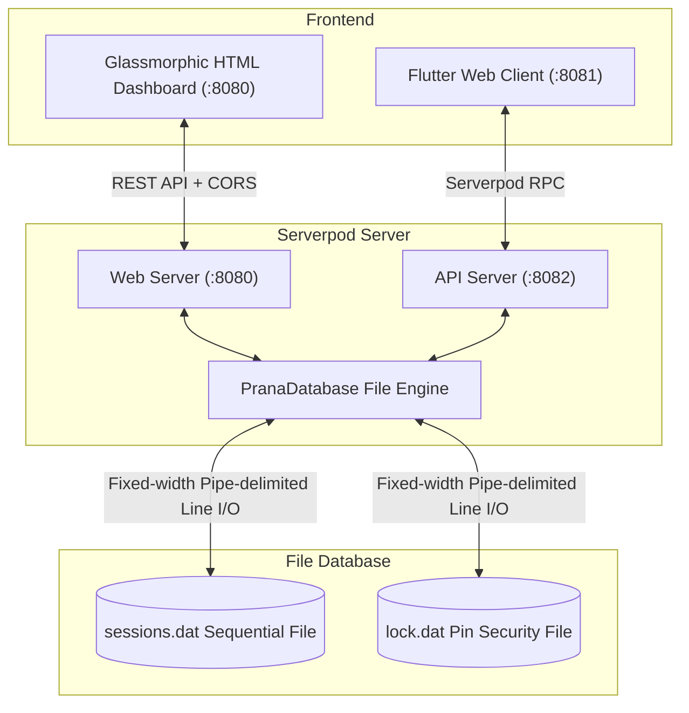

# PranaCOBOL: Guided Breathwork Application (Dart & Serverpod Monorepo)

PranaCOBOL is a guided breathwork application featuring a high-performance backend rewritten in **Dart** using the **Serverpod** framework, and a state-of-the-art Flutter Web dashboard. The project is structured as a monorepo managed by **Melos**.

It supports dynamic breathing methods, session logs database storage via space-padded, fixed-width formats for backwards compatibility, and a lock/unlock security system.

---

## System Architecture



The application is split into three primary packages managed by Melos:
1. **`pranacobol_server`**: The Serverpod server, which runs:
   - The **Web Server** on port `8080` (handles legacy REST routes like `/api/status`, `/api/sessions`, and serves `dashboard.html` at `/`).
   - The **API Server** on port `8082` (handles type-safe RPC endpoints for the Flutter application).
2. **`pranacobol_client`**: The auto-generated Serverpod client SDK. It acts as the bridge, containing model classes and endpoint callers.
3. **`pranacobol_flutter`**: The premium Flutter client application, using `pranacobol_client` to communicate with the API Server on port `8082`.

---

## Monorepo Packages

| Package Name | Path | Purpose |
| :--- | :--- | :--- |
| **`pranacobol_server`** | `packages/pranacobol_server` | Serverpod server containing the database engine (`PranaDatabase`), endpoints, and legacy web/REST compatibility routes. |
| **`pranacobol_client`** | `packages/pranacobol_client` | Client SDK auto-generated by Serverpod from server-side serialization models and endpoints. |
| **`pranacobol_flutter`** | `packages/pranacobol_flutter` | Flutter Web UI application refactored to use the generated Serverpod client. |

---

## Database Schema (Compatibility Layer)

To maintain backwards compatibility, the server persists data to the original COBOL database format:
*   **Sessions File (`sessions.dat`)**:
    *   **Format**: Pipe-delimited (`|`) fixed-width records.
    *   **Record Structure**:
        ```text
        Timestamp (19 chars) | Method (30 chars) | Duration (6 chars) | Notes (50 chars)
        ```
*   **Security Lock File (`lock.dat`)**:
    *   **Format**: Pipe-delimited (`|`) fixed-width record.
    *   **Record Structure**:
        ```text
        Passcode PIN (4 chars) | Lock State (8 chars)
        ```
    *   **Default Configuration**: PIN: `1234` | State: `LOCKED`

---

## Getting Started

### Prerequisites
Make sure you have the following installed on your system:
*   **Flutter SDK** (includes the Dart SDK)
*   **Melos** (`dart pub global activate melos`)

---

### Setup and Bootstrapping

1.  **Bootstrap the Monorepo**:
    Install all package dependencies and link them together using Melos:
    ```bash
    melos run get
    ```

2.  **Generate Serverpod Code** (Optional - if models or endpoints change):
    If you edit the Serverpod models or endpoints on the server, regenerate the client:
    ```bash
    melos run generate
    ```

---

### Running the Application

1.  **Start the Serverpod Backend**:
    From the root directory:
    ```bash
    dart packages/pranacobol_server/bin/main.dart
    ```
    *The Web Server starts on `http://localhost:8080` (serving REST & dashboard.html) and the API server starts on `http://localhost:8082`.*

2.  **Start the Flutter Web client**:
    From the root directory (using Melos command filter):
    ```bash
    cd packages/pranacobol_flutter
    flutter run -d chrome --web-port 8081
    ```
    *The Flutter dashboard will run on port `8081` and communicate directly with Serverpod on port `8082`.*

---

## Automated Verification

You can verify the backend's compatibility and test coverage by running:
```bash
./verify.sh
```
This script starts the Serverpod server in the background, runs integration checks on the REST compatibility routes (port 8080), and stops the server.
